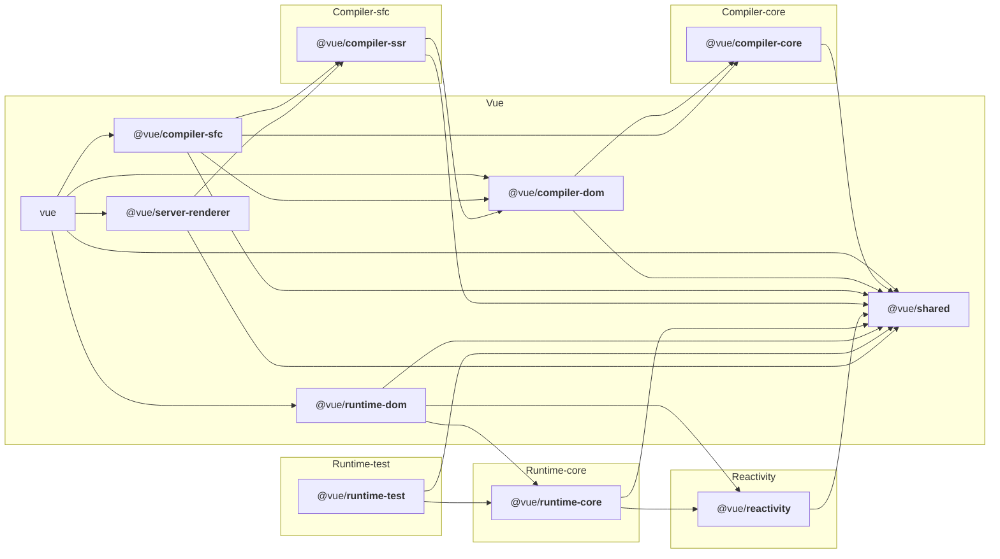

# mini-vue &nbsp;

## Why

## Functions

### Reactivity

- [ ] [reactive]()
- [ ] [ref]()
- [ ] [readonly]()
- [ ] [computed]()
- [ ] [track dependency collection]()
- [ ] [trigger dependency]()
- [ ] [isReactive]()
- [ ] [nested reactive]()
- [ ] [toRaw]()
- [ ] [isReadonly]()

### Compiler-core

### Compiler-dom

### Runtime-core

### Runtime-dom

## FlowChart

Vue3 overall architecture design:

## Usage

## License
