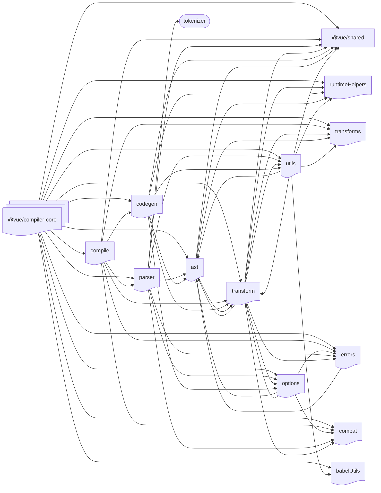
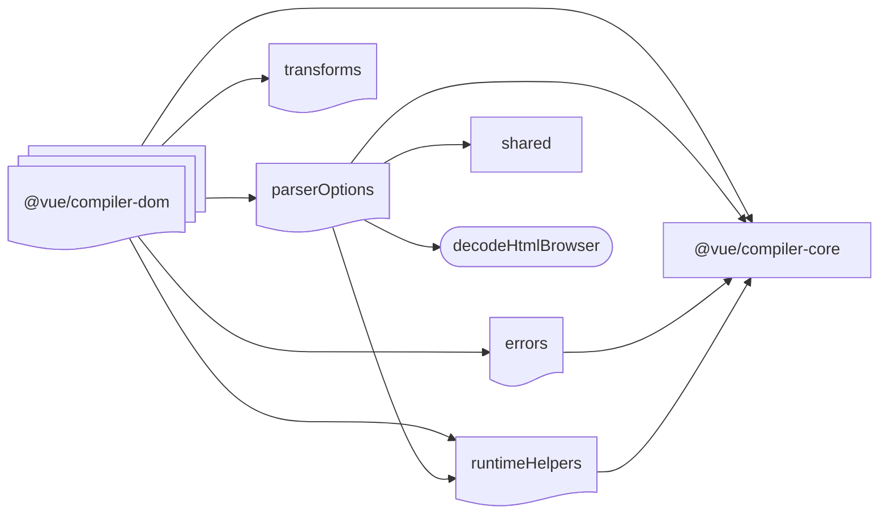
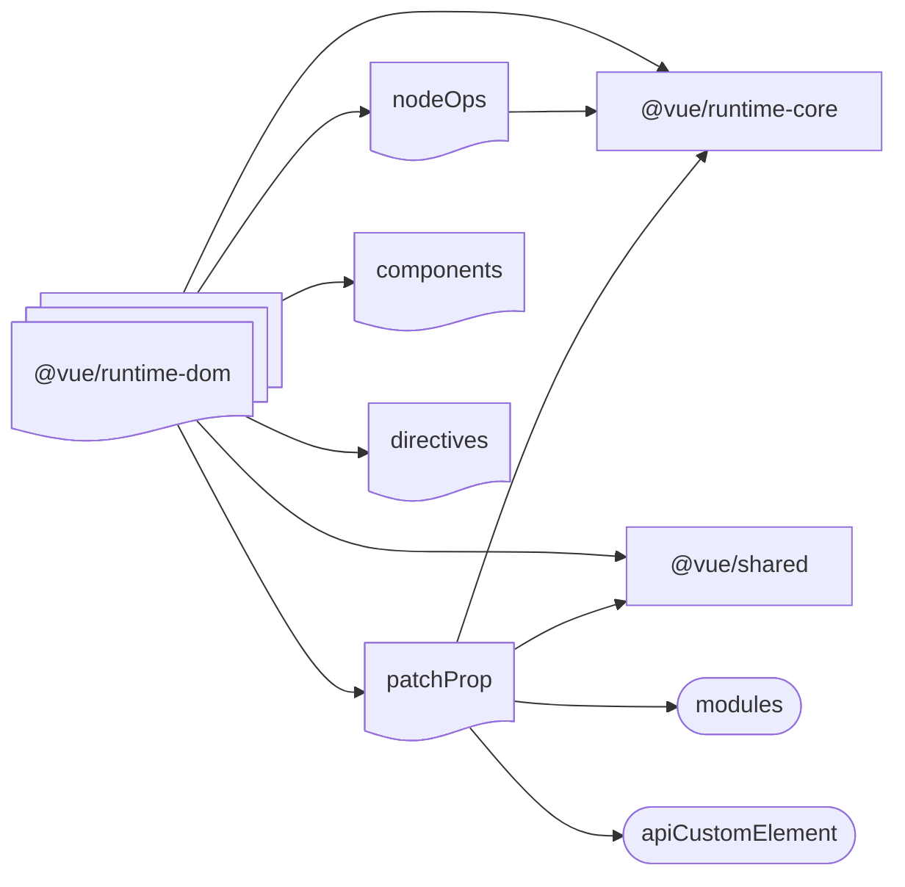

# vue [](./README.md)&nbsp;[](./README.zh-CN.md)

## Architecture design

Vue3 overall architecture design:

```mermaid
flowchart TB
  subgraph Project
    subgraph packages
    compiler-core[@vue/compiler-core] --> shared[@vue/shared]
    compiler-dom[@vue/compiler-dom] --> shared
    compiler-dom --> compiler-core
    compiler-sfc[@vue/compiler-sfc] --> compiler-ssr[@vue/compiler-ssr]
    compiler-sfc --> compiler-core
    compiler-sfc -->  compiler-dom
    compiler-sfc --> shared
    compiler-ssr --> shared
    compiler-ssr --> compiler-dom
    reactivity[@vue/reactivity] --> shared
    runtime-core[@vue/runtime-core] --> shared
    runtime-core[@vue/runtime-core] --> reactivity
    runtime-dom[@vue/runtime-dom] --> shared
    runtime-dom[@vue/runtime-dom] --> reactivity
    runtime-dom[@vue/runtime-dom] --> runtime-core
    runtime-test[@vue/runtime-test] --> shared
    runtime-test[@vue/runtime-test] --> runtime-core
    server-renderer[@vue/server-renderer] --> vue
    server-renderer[@vue/server-renderer] --> shared
    server-renderer[@vue/server-renderer] --> compiler-ssr
    compat[@vue/compat] --> vue

    vue ==> shared
    vue ==> compiler-dom
    vue ==> runtime-dom
    vue ==> compiler-sfc
    vue ==> server-renderer
    end
    subgraph packages-private
    dts-built-test --> vue
    dts-test --> vue
    sfc-playground[@vue/sfc-playground] --> vue
    vite-debug --> vue
    end
  end

```

### @vue/shared


### @vue/reactivity


### @vue/compiler-core



### @vue/compiler-dom



### @vue/runtime-core

```mermaid
flowchart LR
  runtime-core@{ shape: docs, label: "@vue/runtime-core"} --> reactivity["`@vue/reactivity`"]
  runtime-core --> shared["`@vue/shared`"]
  runtime-core --> apiComputed@{ shape: doc, label:'apiComputed' }
  runtime-core --> apiWatch@{ shape: doc, label:'apiWatch' }
  runtime-core --> apiLifecycle@{ shape: doc, label:"apiLifecycle" }
  runtime-core --> apiInject@{ shape: doc, label:"apiInject" }
  runtime-core --> scheduler@{ shape: doc, label:"scheduler" }
  runtime-core --> apiDefineComponent@{ shape: doc, label:"apiDefineComponent" }
  runtime-core --> apiAsyncComponent@{ shape: doc, label:"apiAsyncComponent" }
  runtime-core --> apiSetupHelpers@{ shape: doc, label:"apiSetupHelpers" }
  runtime-core --> helpers@{ shape: doc, label:"helpers" }
  runtime-core --> hydrationStrategies@{ shape: doc, label:"hydrationStrategies" }
  runtime-core --> component@{ shape: doc, label:"component" }
  runtime-core --> h@{ shape: doc, label:"h" }
  runtime-core --> vnode@{ shape: doc, label:"vnode" }
  runtime-core --> components@{ shape: doc, label:"components" }
  runtime-core --> directives@{ shape: doc, label:"directives" }
  runtime-core --> renderer@{ shape: doc, label:"renderer" }
  runtime-core --> warning@{ shape: doc, label:"warning" }
  runtime-core --> errorHandling@{ shape: doc, label:"errorHandling" }
  runtime-core --> customFormatter@{ shape: doc, label:"customFormatter" }
  runtime-core --> devtools@{ shape: doc, label:"devtools" }
  runtime-core --> apiCreateApp@{ shape: doc, label:"apiCreateApp" }
  runtime-core --> componentOptions@{ shape: doc, label:"componentOptions" }
  runtime-core --> componentEmits@{ shape: doc, label:"componentEmits" }
  runtime-core --> componentPublicInstance@{ shape: doc, label:"componentPublicInstance" }
  runtime-core --> hydration@{ shape: doc, label:"hydration" }
  runtime-core --> componentSlots@{ shape: doc, label:"componentSlots" }
  runtime-core --> componentProps@{ shape: doc, label:"componentProps" }
  runtime-core --> hydrationStrategies@{ shape: doc, label:"hydrationStrategies" }
  runtime-core --> hmr@{ shape: doc, label:"hmr" }
  runtime-core --> componentRenderContext@{ shape: doc, label:"componentRenderContext" }
  runtime-core --> componentRenderUtils@{ shape: doc, label:"componentRenderUtils" }
  runtime-core --> compat@{ shape: doc, label:"compat" }

  apiComputed --> reactivity
  apiComputed --> component

  apiWatch --> reactivity
  apiWatch --> scheduler
  apiWatch --> shared
  apiWatch --> component
  apiWatch --> errorHandling
  apiWatch --> renderer
  apiWatch --> warning
  apiWatch --> componentOptions
  apiWatch --> helpers

  apiLifecycle --> component
  apiLifecycle --> componentPublicInstance
  apiLifecycle --> errorHandling
  apiLifecycle --> warning
  apiLifecycle --> components
  apiLifecycle --> reactivity
  apiLifecycle ---> shared
  apiLifecycle --> enums([enums])

  apiInject --> shared
  apiInject --> componentRenderContext
  apiInject --> component
  apiInject --> apiCreateApp
  apiInject --> warning

  scheduler --> errorHandling
  scheduler --> shared
  scheduler --> component

  apiDefineComponent --> componentOptions
  apiDefineComponent --> component
  apiDefineComponent --> componentProps
  apiDefineComponent --> componentEmits
  apiDefineComponent --> shared
  apiDefineComponent --> vnode
  apiDefineComponent --> componentPublicInstance
  apiDefineComponent --> componentSlots
  apiDefineComponent --> directives
  apiDefineComponent --> apiSetupHelpers

  apiAsyncComponent --> component
  apiAsyncComponent --> shared
  apiAsyncComponent --> componentPublicInstance
  apiAsyncComponent --> vnode
  apiAsyncComponent --> apiDefineComponent
  apiAsyncComponent --> warning
  apiAsyncComponent --> reactivity
  apiAsyncComponent --> errorHandling
  apiAsyncComponent --> components
  apiAsyncComponent --> helpers
  apiAsyncComponent --> hydrationStrategies

  apiSetupHelper --> shared
  apiSetupHelper --> component
  apiSetupHelper --> componentEmits
  apiSetupHelper --> componentOptions
  apiSetupHelper --> componentProps
  apiSetupHelper --> warning
  apiSetupHelper --> componentSlots
  apiSetupHelper --> reactivity
  
  hydrationStrategies --> shared
  hydrationStrategies --> hydration

  component --> vnode
  component --> reactivity
  component --> componentPublicInstance
  component --> componentSlots
  component --> componentProps
  component --> warning
  component --> errorHandling
  component --> apiCreateApp
  component --> directives
  component --> componentOptions
  component --> componentEmits
  component --> shared
  component --> components
  component --> compiler-core["`@vue/compiler-core`"]
  component --> componentRenderUtils
  component --> componentRenderContext
  component --> profiling([profiling])
  component --> compat
  component --> scheduler
  component --> enums
  component --> apiDefineComponet
  component --> helpers
  component --> apiAsyncComponent
  component --> renderer

  h --> vnode
  h --> components
  h --> shared
  h --> component
  h --> componentSlots
  h --> componentEmits
  h --> apiDefineComponent

  vnode --> shared
  vnode --> component
  vnode --> componentSlots
  vnode --> reactivity
  vnode --> apiCreateApp
  vnode --> components
  vnode --> directives
  vnode --> warning
  vnode --> componentRenderContext
  vnode --> renderer
  vnode --> helpers
  vnode --> hmr
  vnode --> compat
  vnode --> errorHandling
  vnode --> componentPublicInstance
  vnode --> internalObject([internalObject])

  directives --> vnode
  directives --> shared
  directives --> warning
  directives --> component
  directives --> componentRenderContext
  directives --> errorHandling
  directives --> componentPublicInstance
  directives --> compat
  directives --> reactivity

  renderer --> vnode
  renderer --> component
  renderer --> componentRenderUtils
  renderer --> shared
  renderer --> scheduler
  renderer --> reactivity
  renderer --> componentProps
  renderer --> componentSlots
  renderer --> warning
  renderer --> apiCreateApp
  renderer --> rendererTemplateRef([rendererTemplateRef])
  renderer --> components
  renderer --> hmr
  renderer --> hydration
  renderer --> directives
  renderer --> profiling
  renderer --> devtools
  renderer --> featureFlags([featureFlags])
  renderer --> apiAsyncComponent
  renderer --> compat

  warning --> vnode
  warning --> component
  warning --> errorHandling
  warning --> shared
  warning --> reactivity

  errorHandling --> reactivity
  errorHandling --> vnode
  errorHandling --> component
  errorHandling --> warning
  errorHandling --> shared
  errorHandling --> enums
  
```



### @vue/runtime-dom



## Workflow
